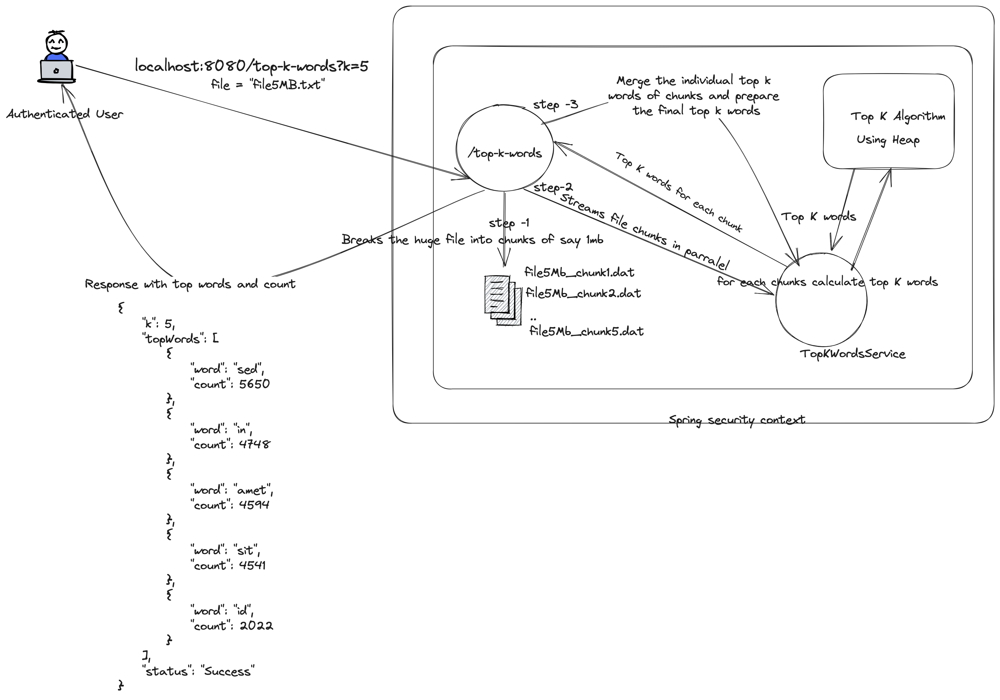
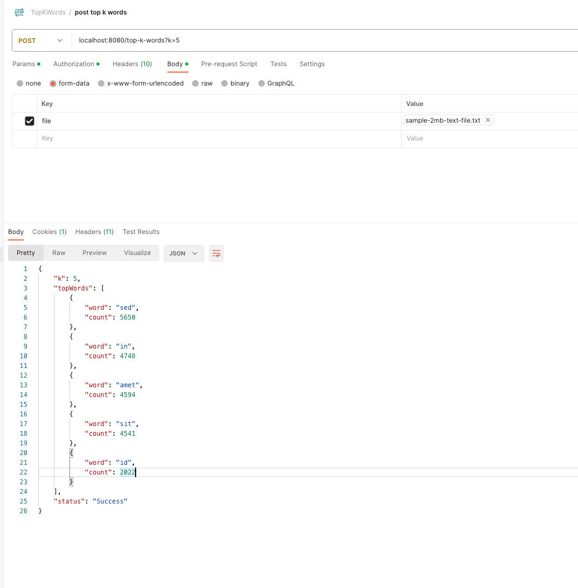

# Top K Words

## Process flow
The Top k process calculates the top frequent words using heap data structure. It can process huge files. It breaks the files in small chunks of 
1mb (configurable) and processes each chunks in parralel. 
After processing in chunks it then merges the result of each chunk and prepares the final result for top k words for the file.


## Tech Stack and Illustration
- Java 17 (Used records in api response models)
- Springboot 3.0
- maven
- Top K words algorithm using heap (Priority Queue)
- redis cache - The api response is cached. 
- Docker for spawning the redis cluster.
- Spring Security with InMemory user to show how an authenticated user works. (In production the user details are present in DB with encrypted or hashed password)
- Junit Test cases, Mockmvc and Integration tests using SpringBootTests

## Api Specification
The application can be accessed via Rest Api
```
POST /top-k-words

Request Parameters
   k int # Specifies the number of frequent words from the file 

Request Body
   file multipart file # A Text file of size upto 10MB.
   ```
## Start the application:
### Method - 1:  Download code from github, build the project, start the project with single docker-compose
1. Git clone
   ```bash
   git clone git@github.com:nilotpalsrkr/TopKWords.git
   ```
2. cd to the repository.
   ```bash
   cd TopKWords
   git checkout master # The latest code is present in master branchg and not in main.
   ```

3. build the TopKWords springboot application
    ```bash
   mvn clean install 
   ```
   Or, use intellij's maven plugin to build the application.
4. Run the redis cluster using - Docker Compose.
```bash
  docker-compose up -d # This step is required for caching the api response. This would run the Redis cluster.
```

5. Set the environment variables:
   ```
   FILE_PERSISTENT_LOCATION=<A Local directory where the chunks of file get created> 
   CHUNK_SIZE=1
   ```
   
6. Start the application
7. Test the application -
   For Basic authentication, username - admin, password - admin 
   ** Postman **
   Import the postman json, placed in the repository
```
src/resources/postman # The file to be tested would require to be updated in the postman collection
Two sample files are also located in test/resources directory.
```


##Steps to create docker image:
```bash
docker build -t nilotpals92/top-k-words:1.0 .
```
Steps to push the image to docker public repo -
```bash
docker push nilotpals92/top-k-words:1.0
```


Output Screens:



### Future Improvements
1. Better centralised Api Exception handling
2. Docker based service